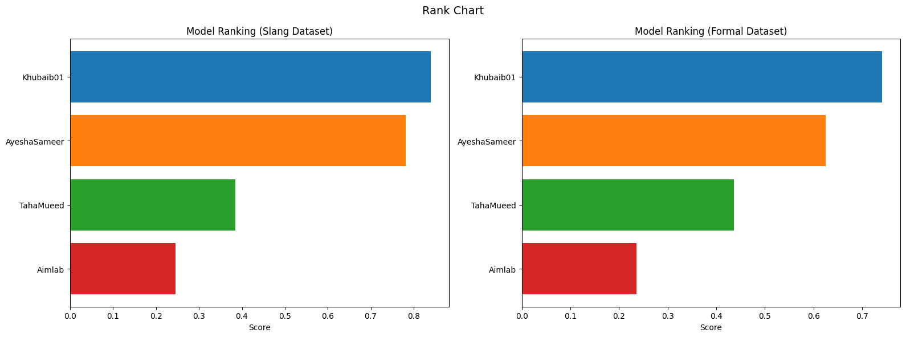

# Roman Urdu Sentiment Analysis Model (Khubaib01)

This model performs **sentiment classification on Roman Urdu text**, labeling input sentences as **Positive, Negative, or Neutral**. It is fine-tuned from `xlm-roberta-base` and designed to handle **Roman Urdu, code-mixed Urdu-English, and social media style text**, including slang-heavy WhatsApp chats, YouTube comments, and Twitter posts.

## Try the Model
Test the model live on Hugging Face Spaces:
[](https://huggingface.co/spaces/Khubaib01/roman-urdu-sentiment)

## Benchmark Highlights

Khubaib01/roman-urdu-sentiment-xlm-r consistently **outperforms all existing Roman Urdu sentiment models**, particularly on **slang-heavy texts** while maintaining strong performance on formal social media datasets.

**Visual Benchmark (Top-Ranked Performance):**



> Benchmark notebook: [Kaggle](https://www.kaggle.com/code/muhammadkhubaibahmad/romanurdu-sentiment-xlm-r-benchmarking)

## Model Details

### Model Description
- Fine-tuned **XLM-RoBERTa Base** for Roman Urdu sentiment classification
- Trained on a **balanced, multi-domain dataset (~99k sentences)**
- Labels: Positive, Negative, Neutral
- Sources: WhatsApp chats, YouTube comments, Twitter, and other social media
- Preprocessing: Removed media-only, deleted, very short, and emoji-only messages
- Developed by: Muhammad Khubaib Ahmad
- License: MIT

### Key Advantages
- **Top-ranking model** across slang-heavy and formal datasets
- **Detects offensive/toxic content** naturally due to slang-heavy negative training data
- Balanced performance across all three sentiment classes
- Robust to multi-domain inputs, including social media and messaging platforms

## Uses

### Direct Use
- Classifying sentiment in Roman Urdu text
- Automated content moderation
- Identifying offensive, abusive, or highly negative content
- Analytics on Roman Urdu datasets, e.g., public sentiment tracking

### Downstream Use
- Feature extraction in multi-task NLP pipelines
- Adaptable for other Roman Urdu classification tasks with additional fine-tuning

### Out-of-Scope
- Native Urdu script without transliteration
- Subtle sarcasm, irony, or context-specific toxicity
- Newly coined or highly domain-specific slang not seen in training

## Bias, Risks, and Limitations
- May inherit biases from the training data (slang, offensive terms, informal language)
- Accuracy may drop on rare, new, or unseen Roman Urdu slang
- Heavy code-mixing or highly non-standard text may be misclassified
- Should not be relied on as a dedicated toxicity detection tool; flags negative/offensive content as part of sentiment

## Recommendations
- Validate predictions for critical applications
- Consider additional fine-tuning for domain-specific scenarios

## How to Get Started

### Quick Start
```python
from transformers import pipeline

pipe = pipeline(
    "text-classification",
    model="Khubaib01/roman-urdu-sentiment-xlm-r",
    truncation=True
)

pipe("ye banda bohot acha hai")

```
### Advanced Usage
```python
from transformers import AutoTokenizer, AutoModelForSequenceClassification

model_id = "Khubaib01/roman-urdu-sentiment-xlm-r"

tokenizer = AutoTokenizer.from_pretrained(model_id)
model = AutoModelForSequenceClassification.from_pretrained(model_id)

inputs = tokenizer("ye insan acha nahi lagta", return_tensors="pt")
logits = model(**inputs).logits
label_id = logits.argmax(dim=-1).item()

id2label = {0:"Positive", 1:"Negative", 2:"Neutral"}
print(id2label[label_id])
```

## Training Details
- Base Model: xlm-roberta-base
- Training regime: fp16 mixed precision, batch size 16, gradient accumulation 4
- Epochs: 2
- Learning Rate: 1e-5
- Optimizer: AdamW
- Evaluation: Epoch-level evaluation using stratified train/validation split

### Training Data

- Sources: WhatsApp chat exports, YouTube comments, Twitter, and other social media.
- Dataset size: ~99k sentences (balanced across Positive, Negative, Neutral).
- Preprocessing: Removed media-only, deleted, emoji-only, and very short messages.

## Evaluation

- Testing: 10% held-out dataset
- Metrics: Accuracy, Macro F1, Confusion Matrix
- Results: Overall Accuracy ~84–85%, Macro F1 ~83–84%
- Benchmarking confirms Khubaib01 is the top-performing model, especially on slang-heavy text

## Metrics

- Accuracy and Macro F1 per class
- Confusion matrix for analyzing misclassifications

## Results

- Overall Accuracy: ~84–85%
- Macro F1: ~83–84%
- Balanced performance across Positive, Negative, and Neutral classes
- Benchmarking against other Roman Urdu sentiment models shows superior performance, especially on slang-heavy texts

## Environmental Impact

- Hardware: NVIDIA T4 GPU (Colab)
- Training Time: ~4–5 hours
- Precision: fp16
- Estimated CO₂ Emissions: Low (approx. 1–2 kg CO₂eq, Colab)

## Technical Specifications

- Model Architecture: XLM-RoBERTa Base (Transformer encoder, 12 layers, 768 hidden size)
- Objective: Sentiment classification (3-class softmax output)
- Software: Python, PyTorch, HuggingFace Transformers
- Tokenizer: SentencePiece-based multilingual tokenizer

## Citation

- BibTeX:
```BibTeX
@misc{roman_urdu_sentiment2025,
  title={Roman Urdu Sentiment Analysis Model},
  author={Muhammad Khubaib Ahmad},
  year={2025},
  note={HuggingFace Transformers model, fine-tuned from xlm-roberta-base}
}
```

- APA:
```APA
Muhammad Khubaib Ahmad. (2025). Roman Urdu Sentiment Analysis Model. HuggingFace Transformers. Fine-tuned from xlm-roberta-base.
```
## Glossary

- Roman Urdu: Urdu language written using the Latin alphabet.
- Code-mixed text: Sentences containing a mix of Roman Urdu and English words.
- fp16: Half-precision floating-point training for faster GPU usage.

## Model Card Author

Muhammad Khubaib Ahmad

Model Card Contact

[Gmail: muhammadkhubaibahmad854@gmail.com](muhammadkhubaibahmad854@gmail.com)

[HuggingFace](https://huggingface.co/Khubaib01)

[Kaggle](https://www.kaggle.com/muhammadkhubaibahmad)

[LinkedIn](https://www.linkedin.com/in/muhammad-khubaib-ahmad-)

[Portfolio](https://huggingface.co/spaces/Khubaib01/KhubaibAhmad_Portfolio)
